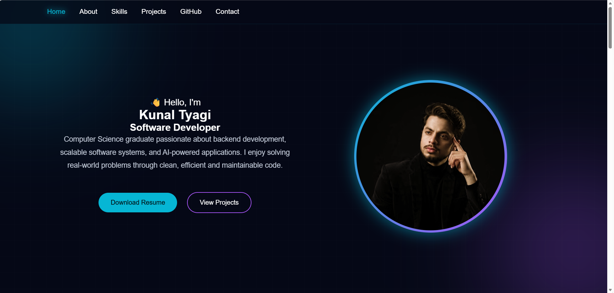

<div align="center">

# ⚡ K U N A L • T Y A G I ⚡


<br>

[](https://portfolio-six-coral-47.vercel.app/)
[](https://github.com/Kunalk077)


</div>

# 🌌 SYSTEM OVERVIEW

```yaml
Name        : Kunal Tyagi
Role        : Software Developer
Education   : B.Tech CSE (2026)
Location    : Uttar Pradesh, India
Status      : Open to Work
```

---

# ⚡ LIVE TERMINAL

```bash
> boot portfolio...

✓ HTML Loaded
✓ CSS Loaded
✓ JavaScript Loaded
✓ Cyberpunk Theme Activated
✓ Portfolio Online

URL:
https://portfolio-six-coral-47.vercel.app/
```

---

# 🛰 FEATURES

```
■ Responsive UI
■ Cyberpunk Design
■ Smooth Navigation
■ Active Navbar
■ Modern Animations
■ Mobile Friendly
■ Glassmorphism
■ Neon Effects
```

---

# ⚙ TECH STACK

<div align="center">

| Frontend | Languages | Tools |
|-----------|-----------|-------|
| HTML5 | C++ | Git |
| CSS3 | Java | GitHub |
| JavaScript | Python | VS Code |
| FastAPI | SQL | PostgreSQL |

</div>

---

# 🚀 PROJECTS

## 🎙 Vocalytics

```
AI Speech Emotion Detection &
Mental Wellness Monitoring
```

**Stack**

```
Python
Machine Learning
CNN
Streamlit
```

---

## 📦 StockFlow

```
Inventory & Order
Management System
```

**Stack**

```
React
FastAPI
PostgreSQL
Docker
```

---

## 🗜 Mini File Compression Tool

```
Lossless File Compression
Developed using C++
```

---

## 🎮 Tic Tac Toe

```
Responsive Browser Game
```

---

# 📸 PREVIEW

# 📸 Portfolio Preview



---

# 📁 DIRECTORY

```text
portfolio/
│
├── assets/
├── index.html
├── style.css
├── script.js
└── README.md
```

---

# 💻 INSTALLATION

```bash
git clone https://github.com/Kunalk077/portfolio.git
```

```bash
cd portfolio
```

```bash
Open index.html
```

or use **Live Server**.

---

# 📡 CONNECT

### 🌐 Portfolio

https://portfolio-six-coral-47.vercel.app/

### 💻 GitHub

https://github.com/Kunalk077

### 💼 LinkedIn

https://www.linkedin.com/in/kunal-tyagi-589745258/

---

<div align="center">


## ⭐ INITIALIZING COMPLETE

```
━━━━━━━━━━━━━━━━━━━━━━━━━━━━━━━

STATUS : ONLINE

Thanks for visiting my portfolio.

If you found this project interesting,
please consider giving it a ⭐.

━━━━━━━━━━━━━━━━━━━━━━━━━━━━━━━

</div>
